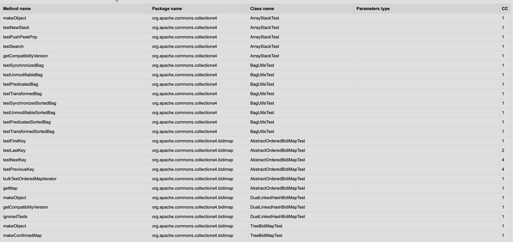
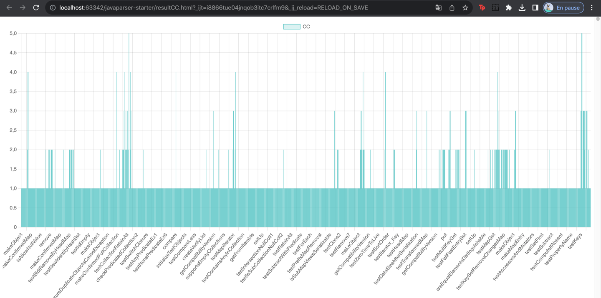
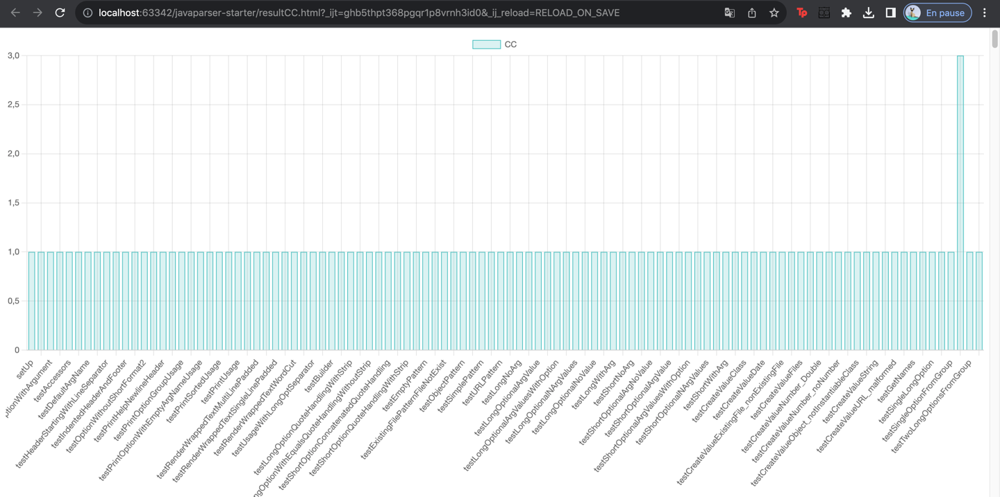

# Code of your exercise
### code de la classe Main
````java
package fr.istic.vv;

import com.github.javaparser.utils.SourceRoot;

import java.io.BufferedWriter;
import java.io.File;
import java.io.FileWriter;
import java.io.IOException;

public class Main {
    private static File resultfile;
    private static StringBuilder htmlContent;
    public static void main(String[] args) throws IOException {
         resultfile = new File("resultCC.html");
        htmlContent = new StringBuilder("<html>" +
                "<head><link rel=\"stylesheet\" type=\"text/css\" href=\"styles.css\">\n" +
               "<script src=\"https://cdn.jsdelivr.net/npm/chart.js\"></script>"+
                "</head>"+
                "<body><table>");
        if(args.length == 0) {
            System.err.println("Should provide the path to the source code");
            System.exit(1);
        }

        File file = new File(args[0]);
        if(!file.exists() || !file.isDirectory() || !file.canRead()) {
            System.err.println("Provide a path to an existing readable directory");
            System.exit(2);
        }

        SourceRoot root = new SourceRoot(file.toPath());
        PublicElementsPrinter printer = new PublicElementsPrinter();
        CyclomaticComplexity membersWithoutGetter = new CyclomaticComplexity(htmlContent);

        root.parse("", (localPath, absolutePath, result) -> {
            result.ifSuccessful(unit -> unit.accept(membersWithoutGetter, null));
            return SourceRoot.Callback.Result.DONT_SAVE;
        });

        htmlContent.append("</table></body></html>");
        writeHtmlToFile(htmlContent.toString());
    }
    private static void writeHtmlToFile(String htmlContent) {
        try (BufferedWriter writer = new BufferedWriter(new FileWriter(resultfile))) {
            writer.write(htmlContent);
        } catch (IOException e) {
            e.printStackTrace();
        }
    }


}

````
### Code de la classe CyclomaticComplexity
```java
package fr.istic.vv;

import com.github.javaparser.ast.CompilationUnit;
import com.github.javaparser.ast.NodeList;
import com.github.javaparser.ast.body.*;
import com.github.javaparser.ast.stmt.*;
import com.github.javaparser.ast.type.TypeParameter;
import com.github.javaparser.ast.visitor.VoidVisitorWithDefaults;

import java.io.BufferedWriter;
import java.io.File;
import java.io.FileWriter;
import java.io.IOException;
import java.util.Arrays;

public class CyclomaticComplexity extends VoidVisitorWithDefaults<Void> {

 StringBuilder htmlContent;
    public CyclomaticComplexity(StringBuilder htmlContent) {
        this.htmlContent = htmlContent;

        htmlContent.append("<tr>"+
                                "<th> Method name    </th>\n"+
                                "<th>Package name</th>\n" +
                                "<th>Class name</th>\n" +
                                " <th>Parameters type</th>\n"+
                                "<th>CC</th>\n"+
                            "</tr>"

        );
        htmlContent.append("<canvas id=\"ccChart\"></canvas>\n" +
                "<script>\n" +
                "var ctx = document.getElementById('ccChart').getContext('2d');\n" +
                "var myChart = new Chart(ctx, {\n" +
                "    type: 'bar',\n" +
                "    data: {\n" +
                "        labels: [],\n" +
                "        datasets: [{\n" +
                "            label: 'CC',\n" +
                "            data: [],\n" +
                "            backgroundColor: 'rgba(75, 192, 192, 0.2)',\n" +
                "            borderColor: 'rgba(75, 192, 192, 1)',\n" +
                "            borderWidth: 1\n" +
                "        }]\n" +
                "    },\n" +
                "    options: {\n" +
                "        scales: {\n" +
                "            y: {\n" +
                "                beginAtZero: true\n" +
                "            }\n" +
                "        }\n" +
                "    }\n" +
                "});\n" +
                "</script>\n");

    }
/*
*  <tr>
    <th>Company</th>
    <th>Contact</th>
    <th>Country</th>
  </tr>*/
    @Override
    public void visit(CompilationUnit unit, Void arg) {
        for (TypeDeclaration<?> type : unit.getTypes()) {
            if (type instanceof ClassOrInterfaceDeclaration) {
                type.accept(this, null);
            }
        }
//        System.out.println("un truc : " + unit.toString());


    }

    public void visitTypeDeclaration(TypeDeclaration<?> declaration, Void arg) {
        //if (!declaration.isPublic()) return;

        String path = declaration.getFullyQualifiedName().orElse("[Anonymous]");

   //     System.out.println(path);
        String names[] =  path.split("\\.");
       // Arrays.stream(names).forEach(e-> System.out.print(e));
        String className =names[names.length -1];
        String pathName =path.substring(0,path.lastIndexOf('.'));


        for (MethodDeclaration method : declaration.getMethods()) {
            String methodName = method.getName().toString();
            String types ="";

            System.out.println(method.getParameters().size());
            for(Parameter tp : method.getParameters()){
                types+=tp.getType().toString()+",";
             //   System.out.println(tp.getType().toString());

            }
            if(!types.isEmpty()) {
                types = types.substring(0,types.length()-1);
            }
            int nbIf = 0;
            if(method.getBody().isPresent()){
                NodeList<Statement> statements = method.getBody().get().getStatements();
                for(Statement statement : statements){
                    if((statement instanceof IfStmt)
                            || (statement instanceof ForStmt)
                            ||(statement instanceof WhileStmt)
                            ||(statement) instanceof DoStmt)
                     nbIf++;
                }
            }

            int cc = nbIf + 1;

          //  System.out.println("Method: " + methodName + ", Types: " + types);
            htmlContent.append("<tr>");
            htmlContent.append("<td>" + methodName+"</td>"+
                            "<td>" + pathName+"</td>"+
                            "<td>" + className+"</td>"+
                            "<td>" + types+"</td>"+
                            "<td>" + cc+"<x/td>"

                    );
            htmlContent.append("</tr>\n");
            htmlContent.append("<script>");
            htmlContent.append("myChart.data.labels.push('" + methodName + "');\n");
            htmlContent.append("myChart.data.datasets[0].data.push(" + cc + ");\n");
            htmlContent.append("</script>");
        }
    }


    @Override
    public void visit(ClassOrInterfaceDeclaration declaration, Void arg) {
        visitTypeDeclaration(declaration, arg);
    }
}


```

### Tableau produit pour le projet Collection :


### Comparaison de Collection et Cli 

#### Histogramme de Collection :





- ##### Le nombre de methodes dans le projet : 7340
- ##### Le somme des CC de chaque methode du projet : 5835
- ##### moyenne : 1.2579263


#### Histogramme de CLI :





- ##### Le nombre de methodes dans le projet : 567
- ##### Le somme des CC de chaque methode du projet : 687
- ##### moyenne : 1.2116402


