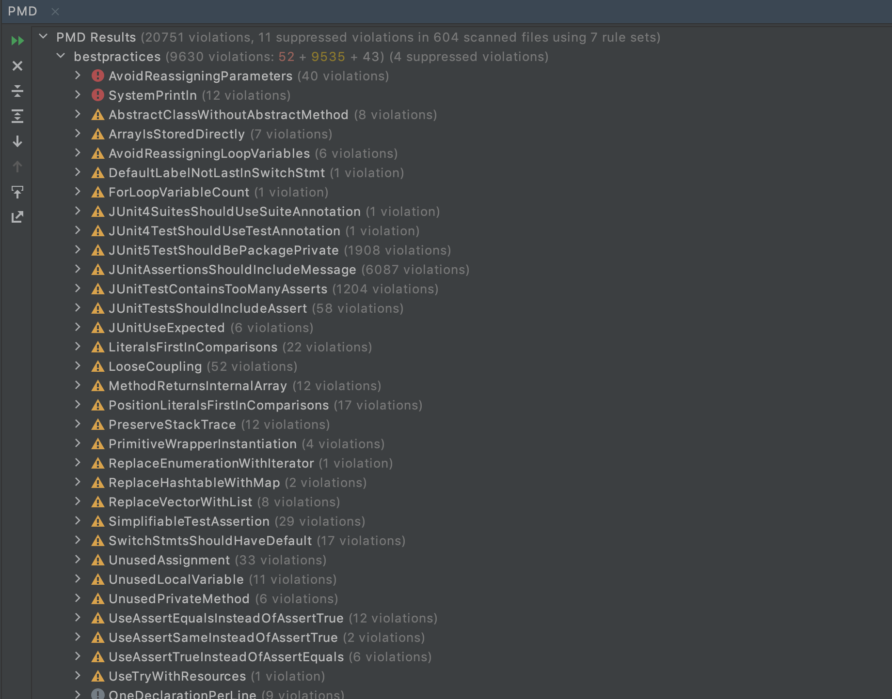

# Using PMD

Pick a Java project from Github (see the [instructions](../sujet.md) for suggestions). Run PMD on its source code using any ruleset. Describe below an issue found by PMD that you think should be solved (true positive) and include below the changes you would add to the source code. Describe below an issue found by PMD that is not worth solving (false positive). Explain why you would not solve this issue.

## Answer

Nous avons utilisé l'extension PMD d'IntelliJ sur le projet Apache Commons Collections et avons trouvé le résultat suivant :




### Avoid reassigning parameters (Vrai positif)

Les paramètres sont souvent considérés comme des valeurs constantes passées à une méthode.
La réaffectation des paramètres peut prêter à confusion car  on s'attend à ce que la valeur des paramètres reste inchangée.


Par exemple dans la  méthode indexOf de la classe ArrayUtils  Apache Commons Collections on a : 

```java
static int indexOf(final Object[] array, final Object objectToFind, int startIndex) {
        if (array == null) {
            return CollectionUtils.INDEX_NOT_FOUND;
        }
        if (startIndex < 0) {
            startIndex = 0;
        }
        if (objectToFind == null) {
            for (int i = startIndex; i < array.length; i++) {
                if (array[i] == null) {
                    return i;
                }
            }
        } else {
            for (int i = startIndex; i < array.length; i++) {
                if (objectToFind.equals(array[i])) {
                    return i;
                }
            }
        }
        return CollectionUtils.INDEX_NOT_FOUND;
    }
```

Le paramètre `startIndex` est modifié dans le corps de la méthoode

Code corrigé :
```java
static int indexOf(final Object[] array, final Object objectToFind, int startIndex) {
        
        if (array == null) {
            return CollectionUtils.INDEX_NOT_FOUND;
        }
        int startIndexCopie = startIndex
        if (startIndexCopie < 0) {
            startIndexCopie = 0;
        }
        if (objectToFind == null) {
            for (int i = startIndexCopie; i < array.length; i++) {
                if (array[i] == null) {
                    return i;
                }
            }
        } else {
            for (int i = startIndexCopie; i < array.length; i++) {
                if (objectToFind.equals(array[i])) {
                    return i;
                }
            }
        }
        return CollectionUtils.INDEX_NOT_FOUND;
    }
```

### One declaration per line (Faux positif) :

Si plusieurs variables sont liées logiquement, les déclarer ensemble peut améliorer la compréhension 
et la lisiblité du code comme dans l'exemple de la déclaration des attributs de la  ReferenceBaseIterator dans la classe
AbstractReferenceMap :

```java
 // These Object fields provide hard references to the
        // current and next entry; this assures that if hasNext()
        // returns true, next() will actually return a valid element.
        K currentKey, nextKey;
        V currentValue, nextValue;
```
